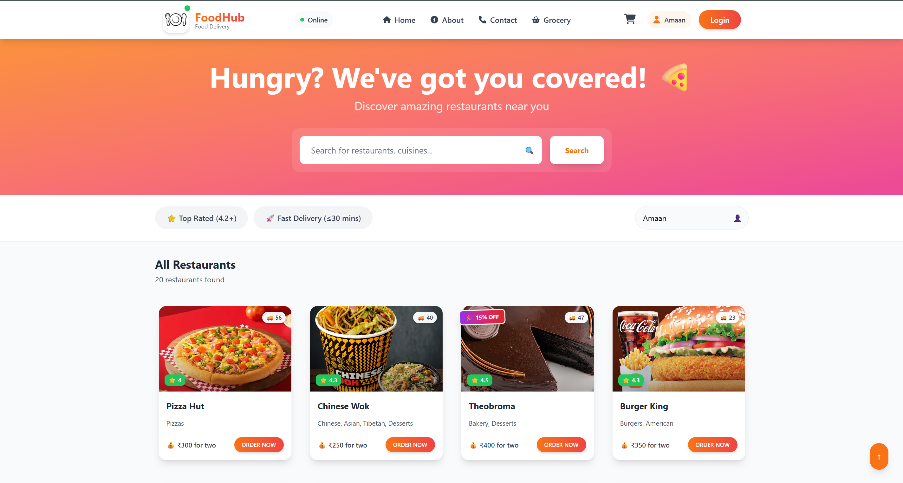
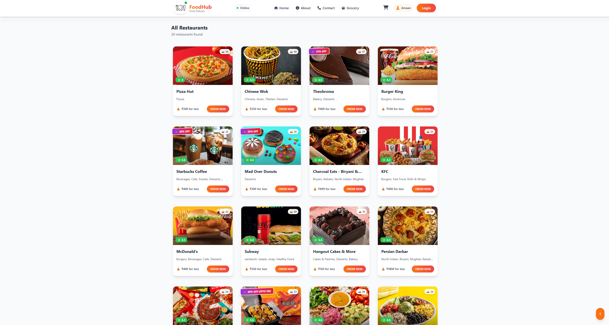
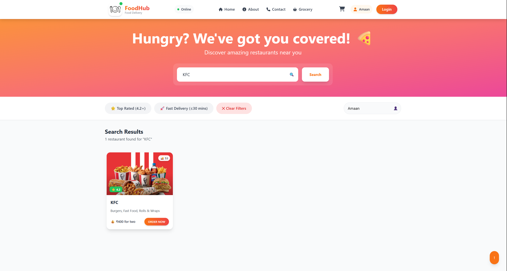
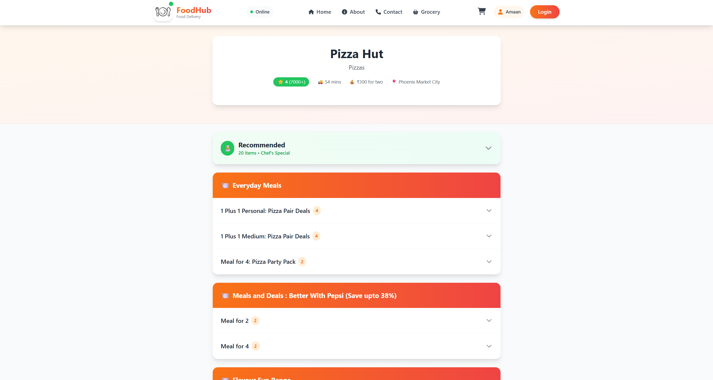
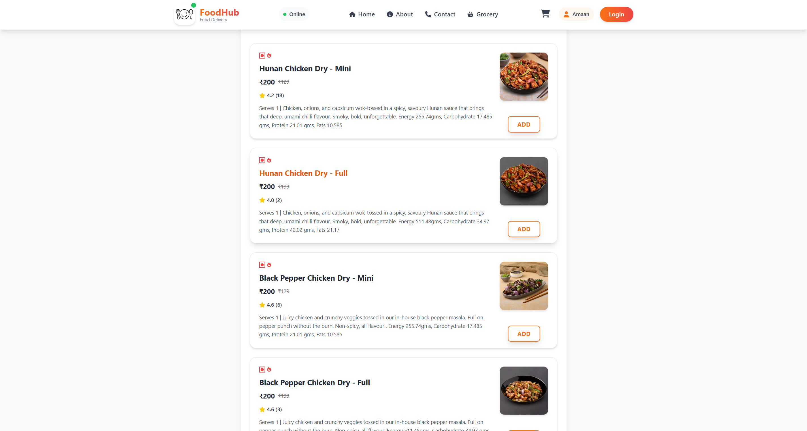
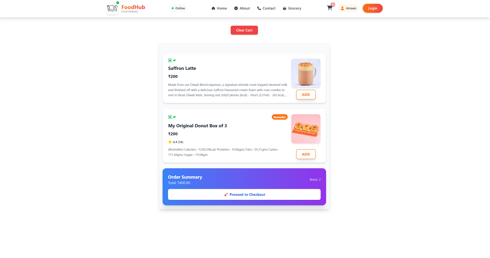

# 🍕 FoodHub - Food Delivery Application

A full-stack food delivery application built with React,Node.js, Redux and Tailwind CSS, featuring real-time restaurant search, cart management, and integrated payment processing.


## 📋 Table of Contents
- [Features](#features)
- [Tech Stack](#tech-stack)
- [Prerequisites](#prerequisites)
- [Installation](#installation)
- [Configuration](#configuration)
- [Running the Application](#running-the-application)
- [Project Structure](#project-structure)
- [Screenshots](#screenshots)
- [API Integration](#api-integration)
- [Testing](#testing)
- [Troubleshooting](#troubleshooting)
- [Contributing](#contributing)
- [License](#license)

## ✨ Features

### Core Functionality
- **User Authentication**: Secure login/signup with protected routes
- **Dynamic Restaurant Search**: Location-based restaurant discovery using Swiggy API
- **Real-time Search**: Instant search results with filtering capabilities
- **Restaurant Filtering**: Filter by ratings, delivery time, and cuisine type
- **Cart Management**: Add, remove, and update items in cart
- **Stripe Payment Integration**: Secure checkout process with payment simulation
- **Lazy Loading**: Optimized performance with code splitting
- **Responsive Design**: Mobile-first approach for all screen sizes

### Technical Highlights
- REST API integration with Swiggy for live restaurant data
- 100% test coverage with integration and unit tests
- State management for cart and user sessions
- Advanced filtering and search algorithms
- Secure payment gateway implementation

## 🛠 Tech Stack

**Frontend:**
- React.js
- React Router (for navigation)
- -Redux (Global State Management)
- Tailwind CSS (Responsive Design)
- Parcel (Bundler)

**Backend:**
- Node.js
- Express.js
- Stripe API
- CORS
- UUID

**APIs:**
- Swiggy API (Restaurant data, menus, images)
- Stripe Payment Gateway

## 📦 Prerequisites

Before you begin, ensure you have the following installed:
- Node.js (v14 or higher)
- npm or yarn
- A Stripe account (for payment integration)
- **CORS Unblock Extension** (for development - see setup below)

## 🚀 Installation

### 1. Clone the repository
```bash
git clone https://github.com/yourusername/foodhub.git
cd foodhub
```

### 2. Install Frontend Dependencies
```bash
cd frontend
npm install
```

### 3. Install Backend Dependencies
```bash
cd ../backend
npm install
```

### 4. Install CORS Bypass Extension

Since the Swiggy API has CORS restrictions, you'll need a CORS bypass extension for development:

**For Chrome/Edge:**
1. Install [CORS Unblock](https://chrome.google.com/webstore/detail/cors-unblock/lfhmikememgdcahcdlaciloancbhjino) or [Allow CORS](https://chrome.google.com/webstore/detail/allow-cors-access-control/lhobafahddgcelffkeicbaginigeejlf)
2. Click on the extension icon and enable it
3. The extension icon should turn green/active

**For Firefox:**
1. Install [CORS Everywhere](https://addons.mozilla.org/en-US/firefox/addon/cors-everywhere/)
2. Click the extension icon to enable it

**Important:** Remember to disable the extension when not developing, as it can pose security risks on other websites.

## ⚙️ Configuration

### Backend Setup

1. **Create a Stripe Account**
   - Visit [stripe.com](https://stripe.com) and create an account
   - Navigate to Developers > API Keys
   - Copy your Secret Key (starts with `sk_test_`)

2. **Configure Environment Variables**
   
   Create a `.env` file in the `backend` directory:
   ```env
   STRIPE_SECRET_KEY=your_stripe_secret_key_here
   ```

3. **Update `.gitignore`**
   
   Ensure your `.env` file is ignored:
   ```gitignore
   .env
   node_modules/
   .parcel-cache/
   dist/
   ```

### Frontend Setup

No additional configuration required. The frontend connects to Swiggy API and the local backend (if running).

## 🏃 Running the Application

### Frontend Only (No Payment Features)

1. **Enable CORS Extension** (Make sure it's active in your browser)

2. **Start the Frontend:**
```bash
cd frontend
npm run start
```

The application will open at `http://localhost:1234`

### Full Application (With Payment Integration)

**Terminal 1 - Backend:**
```bash
cd backend
npm start
```
Backend runs on `http://localhost:1234`

**Terminal 2 - Frontend:**
```bash
cd frontend
npm run start
```
Frontend runs on the port shown in terminal (usually different from backend)

**Don't forget:** Keep the CORS extension enabled while using the app!

## 📁 Project Structure

```
foodhub/
├── frontend/
│   ├── src/
│   │   ├── components/
│   │   ├── pages/
│   │   ├── utils/
│   │   ├── App.js
│   │   └── index.html
│   ├── package.json
│   └── .parcel-cache/
├── backend/
│   ├── server.js
│   ├── package.json
│   └── .env
├── images/
│   ├── home-page.png
│   ├── restaurant-listings.png
│   ├── search-results.png
│   ├── restaurant-menu.png
│   ├── menu-items.png
│   ├── shopping-cart.png
│   ├── welcome-page.png
│   ├── about-page.png
│   ├── features.png
│   └── contact-page.png
└── README.md
```

## 📸 Screenshots

### Home Page


*Search for restaurants and explore cuisines with real-time results*

### Restaurant Listings


*Browse through 20+ partner restaurants with ratings, delivery times, and special offers*

### Search & Filter


*Advanced search with real-time filtering by cuisine, rating, and delivery time*

### Restaurant Menu


*Explore detailed menus organized by categories with chef recommendations*

### Menu Items


*View detailed item descriptions with nutritional information and pricing*

### Shopping Cart


*Manage your order with easy add/remove functionality and real-time total calculation*

### Welcome Page


*Engaging landing page with compelling call-to-action*

### About Us


*Learn about FoodHub's mission: 200+ partner restaurants, 10,000+ happy orders, 50+ cuisines*

### Why Choose Us


*Lightning-fast delivery, secure payments, accurate tracking, and quality assurance*

### Contact


*Easy-to-use contact form with multiple communication channels*

## 🔌 API Integration

### Swiggy API
The application integrates with Swiggy's public API to fetch:
- Restaurant listings based on location coordinates
- Restaurant details, ratings, and reviews
- Complete menu items with high-quality images
- Real-time availability and delivery estimates
- Dynamic pricing and offers

**Note:** Due to CORS policies, you need to use a CORS bypass extension during development.

### Stripe Payment API
Secure payment processing with:
- Customer creation and management
- Payment intent handling
- Card tokenization
- Transaction receipts via email
- Comprehensive error handling and validation

## 🧪 Testing

The application maintains 100% test coverage using modern testing frameworks:

```bash
# Run all tests
npm test

# Run tests with coverage
npm run test:coverage

# Run tests in watch mode
npm run test:watch
```

**Test Types:**
- Unit tests for individual components
- Integration tests for API calls and data flow
- End-to-end tests for complete user journeys

## ⚠️ Troubleshooting

### CORS Issues
If you see CORS errors in the console:
1. Ensure the CORS extension is installed and enabled
2. Refresh the page after enabling the extension
3. Check that the extension icon shows it's active (usually green)

### Parcel Cache Issues
If you encounter build errors:
```bash
rm -rf .parcel-cache
rm -rf dist
npm run start
```

On Windows:
```bash
rmdir /s /q .parcel-cache
rmdir /s /q dist
npm run start
```

### Stripe Payment Errors
- Verify your `.env` file has the correct `STRIPE_SECRET_KEY`
- Make sure you're using a test key (starts with `sk_test_`)
- Check that the backend server is running on the correct port

## 🤝 Contributing

Contributions are welcome! Please follow these steps:

1. Fork the repository
2. Create a feature branch (`git checkout -b feature/AmazingFeature`)
3. Commit your changes (`git commit -m 'Add some AmazingFeature'`)
4. Push to the branch (`git push origin feature/AmazingFeature`)
5. Open a Pull Request

## 📝 License

This project is licensed under the MIT License - see the LICENSE file for details.

## 🔒 Security Note

**Important:** 
- Never commit your `.env` file or expose your Stripe secret keys
- Always use environment variables for sensitive data
- Disable the CORS bypass extension when not developing
- The CORS extension should only be used in development, never in production

## 📧 Support

For support:
- **Email:** kamaan551@gmail.com

Or open an issue in the repository.

---

**Development Only:** The CORS bypass extension is only for local development to bypass Swiggy API restrictions. In production, you would need to implement a proper backend proxy or use officially sanctioned APIs.
